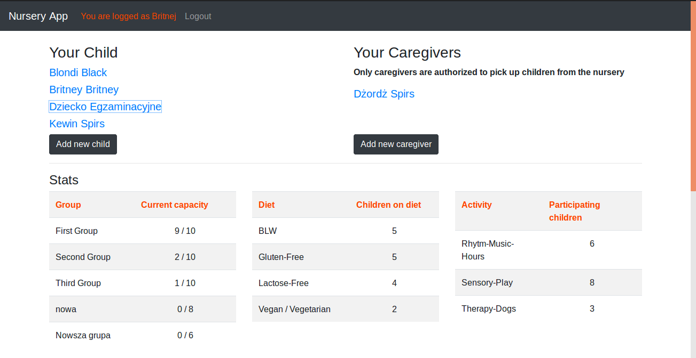
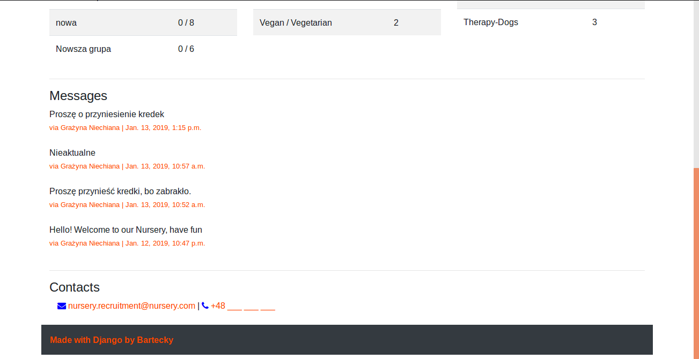
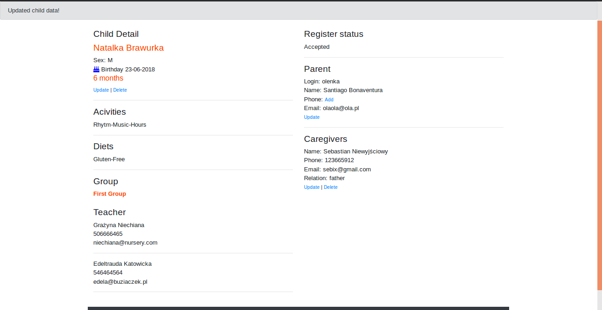
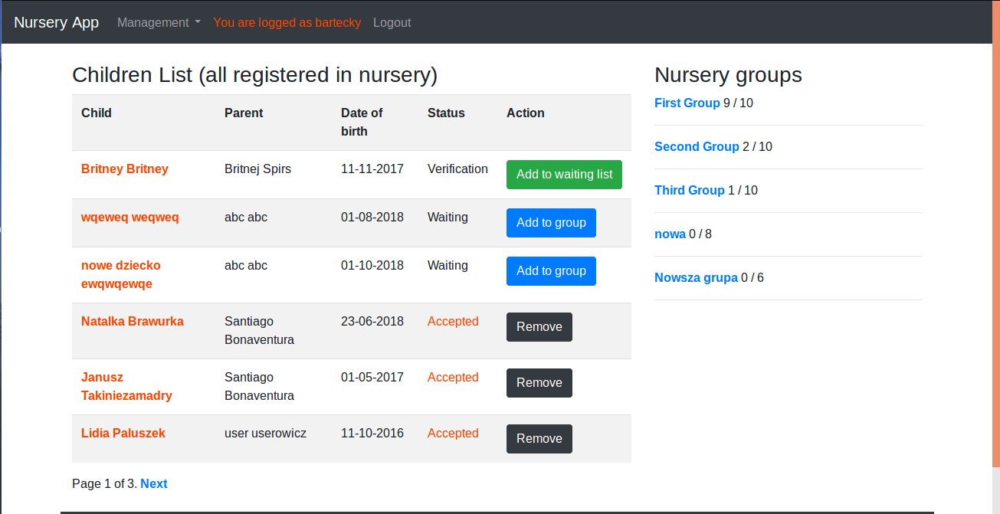
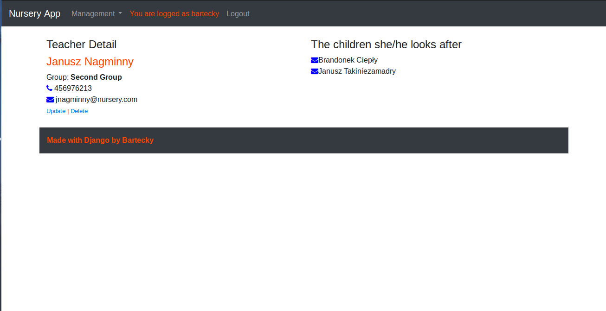
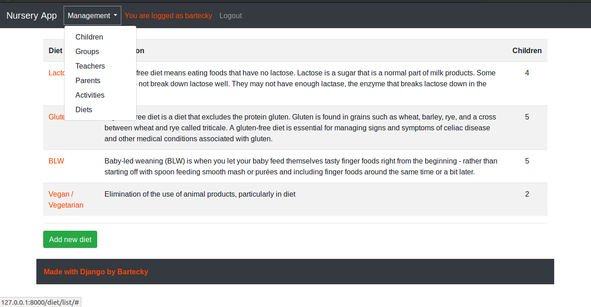

**Nursery App**

The project allows you to manage nursery, it's for parents and staff.
Parent has the option of registering a child and caregivers (f.e. able to pick up child from nursery) 
Staff has several options, can add/modify/delete groups, extra activities, diets for children, teachers. 
Important thing for staff is easy recruitment panel - children list, sorted by status (verified, on waiting list, in nursery)

**Start project**

Clone repository, create your own virtualenv and activate it. 
In terminal: 
`virtualenv -p python3 <your-dir-name>` 
next: 
`source <your-dir-name>/bin/activate` 
install requirements from project: 
`pip install requirements.txt`

Running: 
You need postgresql and db called 'nurseryapp' 
_Apply migrations:_ 
`python manage.py migrate` 
and run project: 
`python manage.py runserver`

IMPORTANT:
You have to create super user by:
`python manage.py createsuperuser` and login into this account to see staff features in project.

**Screens**

Parent view 

Parent view2 

Child detail 

Children list 

Teacher detail 

Management 

